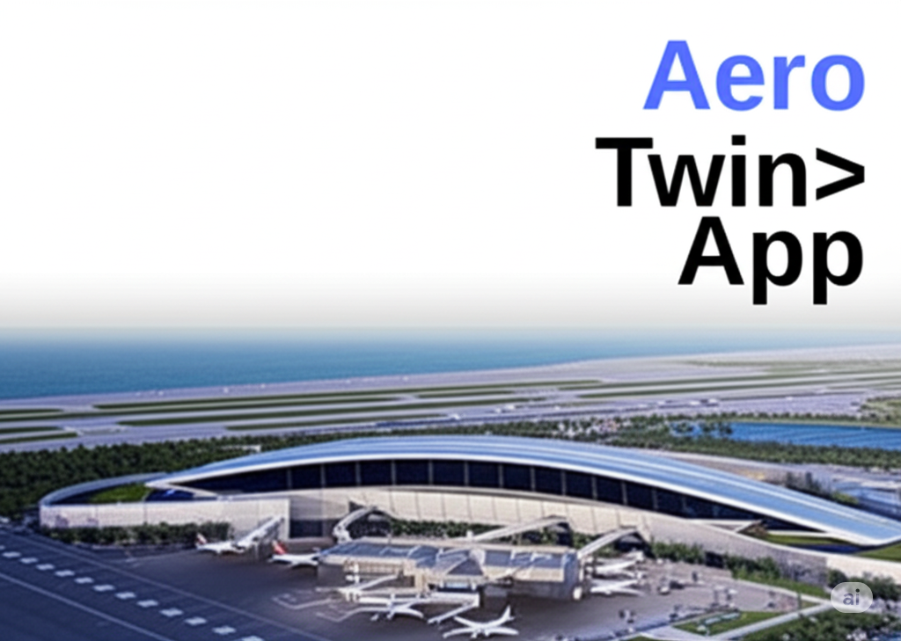

# Aerotwin
Digital Twin for Airports with 360 integrations on air and land side

 
AeroTwin is a modular, plug-and-play digital twin for modern airports and airside operations. It combines highly realistic 3D modeling with live or simulated aircraft movements, offering a unified view of land and airside activities.

## Key Features of AeroTwin

Our AeroTwin platform offers a comprehensive suite of features designed to revolutionize airport operations and training:

* **Realistic 3D Environments:** Experience highly detailed and accurate 3D representations of terminals, aprons, and runways, providing an immersive and true-to-life operational view.
* **Game Engine-like Simulations:** Benefit from realistic simulations of aircraft landings and departures on runways, powered by advanced game engine technology for unparalleled visual fidelity and physics.
* **Dynamic Aircraft Movement:** Real-time aircraft movement simulation integrated with live transponder data, offering an accurate and up-to-the-minute view of airside activity.
* **Seamless System Integration:** Robust capabilities for integration with existing airport systems, supporting both synchronous and asynchronous (queue-based) communication methods.
* **Integrated RF Communications:** Comprehensive simulation of radio frequency communications, including cockpit-to-ATC interactions, ACARS (Aircraft Communications Addressing and Reporting System), ATIS (Automatic Terminal Information Service), and NOTAMs (Notices to Airmen).
* **API-Driven Platform:** A powerful API (Application Programming Interface) driven platform facilitating easy and flexible integration with various airport management systems such as AMS (Airport Management System), MRO (Maintenance, Repair, and Overhaul), and BHS (Baggage Handling System).
* **Advanced Operational Insights:** Integration with real-time weather data, Turnaround Time (TAT) predictions, intelligent stand allocations, and comprehensive KPI (Key Performance Indicator) integration for optimized decision-making and performance monitoring.

Coming soon.
# Enabled Features
- **3D Airport Visualization**: Interactive 3D airport model using JS
- **Real-time Weather**: Live weather data from Open-Meteo API
- **Plane Management**: Dynamic plane positioning and rotation
- **Stand Management**: Aircraft stand configuration and control
- **Real-time Communication**: WebSocket and RabbitMQ integration
- **Ops Chat**: Real-time operations chat (Socket.IO) with presence and rolling feed
- **Apron Watch**: Video analytics overlay (Roboflow) with event logging and CDM updates
- **Control Panel**: Interactive controls for managing the digital twin
- **Responsive Design**: Modern UI with Angular Material
- 

 

## Technology Stack

### Frontend
- **Angular 17**: Modern web framework
- **CES**: 3D geospatial visualization
- **Angular Material**: UI components
- **Socket.IO Client**: Real-time communication (chat, plane/stand updates)
- **RxJS**: Reactive programming

### Backend
- **Node.js**: Server runtime
- **Express**: Web framework
- **MongoDB**: NoSQL database
- **RabbitMQ**: Message broker
- **Socket.IO**: Real-time communication (chat, alerts, plane/stand updates)
- **Mongoose**: MongoDB ODM

### External APIs
- **Open-Meteo**: Free weather API
- **Ion**: 3D terrain and imagery
- **Vision**: Serverless inference workflow (Apron Watch)

## Prerequisites

- Node.js 18+ and npm
- MongoDB 5+
- RabbitMQ 3.8+
- Angular CLI 17+

## Installation

### 1. Clone the Repository
```bash
git clone <repository-url>
cd airport-digital-twin
```

### 2. Install Dependencies
```bash
# Install Angular dependencies
npm install

# Install backend dependencies
cd server
npm install
cd ..
```

### 3. Environment Setup
Create a `.env` file in the root directory:
```env
# Server Configuration
PORT=3000
NODE_ENV=development

# MongoDB Configuration
MONGODB_URI=mongodb://localhost:27017/airport-digital-twin

# RabbitMQ Configuration
RABBITMQ_URL=amqp://localhost

# viewer Configuration
viewer_ACCESS_TOKEN=your_token_here

# Weather API Configuration
WEATHER_UPDATE_INTERVAL=300000
```

### 4. Database Setup
Start MongoDB:
```bash
# On Windows
"C:\Program Files\MongoDB\Server\6.0\bin\mongod.exe"

# On macOS/Linux
mongod
```

### 5. RabbitMQ Setup
Install and start RabbitMQ:
```bash
# On Windows (using Chocolatey)
choco install rabbitmq

# On macOS
brew install rabbitmq

# Start RabbitMQ
rabbitmq-server
```

### 6. Asset Files
Place the following files in `src/assets/`:
- `del.geojson` - Airport GeoJSON data
- `stands.csv` - Stand configuration data
- `t3.glb` - Terminal 3 3D model
- `sj.glb` - SpiceJet plane model
- `indigo.glb` - Indigo plane model
- `watch.mp4` - Apron Watch sample video
- `chat.png`, `eye.png` - Icons for Ops Chat and Apron Watch

## Running the Application

### Development Mode
```bash
# Terminal 1: Start the backend server (Socket.IO + APIs)
npm run backend

# Terminal 2: Start the Angular dev server
npm run start

# Or run both simultaneously
npm run dev
```

### Production Build
```bash
# Build the Angular application
npm run build

# Start the production server
npm run backend
```

## Project Structure

```
airport-digital-twin/
├── src/
│   ├── app/
│   │   ├── components/
│   │   │   ├── viewer/
│   │   │   ├── weather-widget/
│   │   │   └── control-panel/
│   │   ├── services/
│   │   │   ├── data.service.ts
│   │   │   ├── weather.service.ts
│   │   │   └── message.service.ts
│   │   ├── app.component.ts
│   │   └── app.module.ts
│   ├── assets/
│   │   ├── del.geojson
│   │   ├── stands.csv
│   │   ├── t3.glb
│   │   ├── sj.glb
│   │   └── indigo.glb
│   ├── index.html
│   ├── main.ts
│   └── styles.css
├── server/
│   └── server.js
├── package.json
├── angular.json
├── tsconfig.json
└── README.md
```

## API Endpoints

### Stands
- `GET /api/stands` - Get all stands
- `GET /api/stands/:id` - Get stand by id
- `PUT /api/stands/:standNumber` - Update stand rotation

### Planes
- `GET /api/planes` - Get all planes
- `PUT /api/planes/:planeId` - Update plane position

### CDM
- `PUT /api/cdm/:id` - Upsert CDM record fields (e.g., `fuel_done`, `baggage_done`)

### Weather
- `GET /api/real-time` - Get real-time data
- WebSocket events for live updates

## Real-time Features

### WebSocket Events
- `plane-update` - Plane position/rotation updates
- `stand-update` - Stand configuration changes
- `weather-update` - Weather data updates
- `system-command` - System control commands

### RabbitMQ Queues
- `plane-updates` - Plane data queue
- `stand-updates` - Stand data queue
- `weather-updates` - Weather data queue
- `system-commands` - System commands queue

## Control Panel Features

### Stand Management
- Select stand (55 or 62)
- Set rotation angle (-180° to 180°)
- Real-time updates

### Plane Controls
- Refresh planes
- Clear planes
- Position management

### Camera Controls
- Fly to Terminal 3
- Fly to stands
- Reset camera position

### Weather Controls
- Manual weather refresh
- Auto-update toggle
- Real-time weather display

## Configuration

###  Configuration
The application uses 3D visualization with:
- World terrain
- Dark imagery tiles
- Custom access token
- Optimized performance settings

### Weather Integration
- Open-Meteo API for free weather data
- Automatic updates every 5 minutes
- Real-time weather effects

### Database Models
- **Stand**: Aircraft stand configuration
- **Plane**: Aircraft position and status
- **Weather**: Weather data history

## Troubleshooting

### Common Issues

1. **Scene not loading**
   - Check  access token
   - Verify asset files are in correct location
   - Check browser console for errors

2. **MongoDB connection failed**
   - Ensure MongoDB is running
   - Check connection string in .env
   - Verify database permissions

3. **RabbitMQ connection failed**
   - Ensure RabbitMQ is running
   - Check connection URL
   - Verify queue permissions

4. **Angular build errors**
   - Clear node_modules and reinstall
   - Check TypeScript version compatibility
   - Verify Angular CLI version

### Performance Optimization

1. **3D Performance**
   - Reduce model complexity
   - Optimize texture sizes
   - Use LOD (Level of Detail)

2. **Network Performance**
   - Enable compression
   - Use CDN for static assets
   - Optimize API responses

## Contributing

1. Fork the repository
2. Create a feature branch
3. Make your changes
4. Add tests if applicable
5. Submit a pull request

## License

This project is licensed under the MIT License.

## Support

For support and questions:
- Create an issue in the repository
- Check the troubleshooting section
- Review the API documentation

## Future Enhancements

- [ ] Multi-airport support
- [ ] Advanced weather effects
- [ ] Aircraft traffic simulation
- [ ] Mobile application
- [ ] Analytics dashboard
- [ ] Machine learning integration
- [ ] AR/VR support 

# ATC ACARS integration 
 

